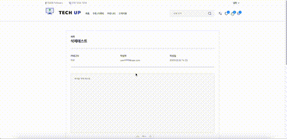

      

 

## 🎁팀원 소개
> **[한화시스템 BEYOND SW캠프 12기] Final Project** 

> **404Fount팀 Tech-Up 프로젝트**

<table align="center">
 <tr>
    <td align="center"><a href="https://github.com/GoodLeaf"></td>
    <td align="center"><a href="https://github.com/museongkim0"></td>
    <td align="center"><a href="https://github.com/gunha0405"></td>
    <td align="center"><a href="https://github.com/Xen-alpha"></td>
  </tr>
  <tr>
    <td align="center">🐥<a href="https://github.com/GoodLeaf"><b>김정엽</b></td>
    <td align="center">🦊<a href="https://github.com/museongkim0"><b>김무성</b></td>
    <td align="center">😼<a href="https://github.com/gunha0405"><b>오건하</b></td>
    <td align="center">🐰<a href="https://github.com/Xen-alpha"><b>황경윤</b></td>
  </tr>

  </table>
 

### 목차

- [🛠 기술 스택](#-기술-스택)
- [📚 Tech-Up 데모 사이트 링크](#-Tech-Up-데모-사이트-바로가기)
- [🎨 Tech-Up 서비스 소개](#-Tech-Up-서비스-소개)
- [🏗️ 시스템 아키텍처](#️-시스템-아키텍처)
- [📚 프론트엔드 프로젝트 목표](#-프론트엔드-프로젝트-목표)
- [📈 프로젝트 설계](#-프로젝트-설계)
- [⚙️ 주요 기능 시연](#️-주요-기능-시연)
- [🚀 핵심 로직 상세 설명](#-핵심-로직-상세-설명)
- [📂 프로젝트 폴더 바로가기](#-백엔드-devops-프로젝트-폴더-바로가기)
  

## 🛠 기술 스택

#### &nbsp;　[ Frontend ]
&nbsp;&nbsp;&nbsp;&nbsp;

#### &nbsp;　[ Backend ]
&nbsp;&nbsp;&nbsp;&nbsp;

#### &nbsp;　[ DB ]
&nbsp;&nbsp;&nbsp;</a>
 

#### &nbsp;　[ CI/CD ]
&nbsp;&nbsp;&nbsp;&nbsp;

#### &nbsp;　[ Etc ]
&nbsp;&nbsp;&nbsp;&nbsp;

#### &nbsp;　[ Communication ]
&nbsp;&nbsp;&nbsp;&nbsp;

   

## 📚 Tech-Up 데모 사이트 바로가기
### [공개 버전 링크](https://techup.p-e.kr/)
### [관리자 대시보드](https://techup.p-e.kr/dashboard)

  
## 🎨 Tech-Up 서비스 소개

      

#### 프로젝트 배경
 - 사용자 맞춤 부품 추천 플랫폼  
 - 고객이 등록한 본인 제품 정보 및 사용자 행동(위시리스트, 장바구니, 리뷰 등)을 바탕으로 연관된 상품을 알 수 있다. 
   고사양을 요하지 않는 일반 사용자들은 기기 전체를 바꾸는 것보다 필요한 부분만 간단히 업그레이드하길 원한다. 하지만 부품의 호환성, 업그레이드 범위, 관련된 추가 제품을 파악하는 일은 일반 사용자에게 쉽지 않다. 
   “Tech-Up”은 그런 사용자들을 위한 가벼운 업그레이드 추천 중심의 서비스이다.
 

- `연관성 높은 제품 추천` : 사용자가 등록하거나 사이트에서 구매한 자신의 제품에 관한 데이터를 분석하여 연관 제품을 제안하고, 사용자의 현재 제품 사양에 기반하여 간단한 업그레이드(예: RAM 용량 증가, SSD 용량 확장, CPU 코어 수 증가 등) 중심으로 추천하는 데 중점을 둔다. 단, 제품 간 호환성 자동 판단은 제공하지 않으며 사용자가 스스로 확인하도록 안내한다. 
- `즉각적인 추천 제품 구매` : 제품 간 비교 페이지에서 추천받은 제품은 즉시 장바구니에 담아 주문할 수 있다. 
- `커뮤니티 형성` : 회원 간의 부품 호환성에 관한 지식 공유를 통해 협력 문화를 조성한다.
 

#### 세부 기능
  - `제품 목록/상세 조회` 
    검색, 제품 카테고리 및 필터로 목록을 조회하고 상세 정보를 확인할 수 있는 기능
  - `기기 등록` 
    사용자가 본인의 기기를 등록하고 관리할 수 있는 기능
  - `장바구니 & 위시리스트` 
    사용자가 관심있는 제품을 담고 취소하며 관리할 수 있는 기능
  - `주문/결제` 
    사용자가 원하는 제품을 주문하고 결제할 수 있는 기능
  - `상품 리뷰` 
    사용자가 제품에 대해 별점과 리뷰를 남길 수 있는 기능
  - `마이페이지` 
    사용자가 개인 정보 및 활동 내역을 조회하고 관리할 수 있는 기능
  - `알림` 
    사용자에게 공통 알림, 개인 알림(주문 완료, 재입고, 품절임박 등)을 제공하는 기능
  - `추천` 
    사용자가 등록한 제품과 유사한 제품, 유사한 사용자가 관심있어한 제품 등 사용자 행동 기반 개인화 추천 기능
  - `쿠폰 이벤트` 
    선착순 쿠폰 및 사용자 지정 쿠폰을 제공하는 기능
  - `기타 지식을 공유하는 커뮤니티` 
    사용자가 개인의 경험 및 지식을 공유할 수 있는 공간을 제공하는 기능
  - `어드민` 
    매출, 판매량, TOP위시리스트 등 통계량을 확인할 수 있는 대시보드와 쿠폰 발급, 알림 발행, 사용자/제품 관리 등의 관리 기능 제공
 

## 🏗️ 시스템 아키텍처

## 📚 프론트엔드 프로젝트 목표
- `개인화된 경험 제공` : 사용자의 등록 제품 및 행동 패턴에 기반한 맞춤형 UI 제공.
- `일관된 디자인 시스템 구축` : 전체 서비스에서 일관된 디자인 언어와 컴포넌트 적용.
- `NuxtJS를 활용한 파일 기반 라우팅` : 파일 시스템 기반 라우팅을 통한 명확하고 예측 가능한 애플리케이션 구조 구현.
- `Pinia를 이용한 데이터 중앙 관리` : 기능별 스토어 분리를 통한 코드 구조화 및 유지보수성 향상.
- `Axios를 이용한 API 연동` : 서비스 계층을 통한 백엔드 API 호출의 표준화 및 재사용성 향상.
 

## 📈 프로젝트 설계

### [1. 기획서 바로가기](https://docs.google.com/document/d/16gP1yR5g0CdxHhqj8PXJoByyoDGGJnpJ/edit?usp=sharing&ouid=114636369401934471820&rtpof=true&sd=true)

### [2. 요구사항 정의서](https://docs.google.com/spreadsheets/d/1lb-SckwF90w3tpbJPMl18hdyDSESCkCRWy9koUEmFbI/edit?usp=sharing)

### [3. WBS](https://docs.google.com/spreadsheets/d/1ZyTxJWcncdOwUFm7sC4lPoY8Tqr1N9bT/edit?usp=sharing&ouid=114636369401934471820&rtpof=true&sd=true)

### [4. 화면설계서 바로가기](https://www.figma.com/design/iJvl1G2NeaJ16nfu0IkcUh/404Found?node-id=0-1&t=e4BsxJGkX5qVDjfZ-1)

  

## ⚙️ 주요 기능 시연

회원가입

      

> 이메일, 비밀번호, 닉네임로 회원 가입을 한다. 
> 이메일, 닉네임은 **중복이 불가능**하며, 비밀번호는 8자 이상의 영문 및 숫자여야 한다. 
> 계정 생성 스패밍을 막기 위해 이메일 인증을 해야 가입할 수 있다.

로그인 & 로그아웃

- 로그인 & 로그아웃

      

> 이메일, 비밀번호로 로그인한다. 
> 로그아웃을 클릭하여 로그아웃한다.

- 소셜 로그인  

      

> 소셜 로그인은 소셜로 로그인 한 후 로그인한 사용자 계정의 이름을 받아온다. 
> 소셜 로그인 사용자는 소셜 로그인으로만 로그인할 수 있다.

- 비밀번호 찾기  

      

> 이메일 인증을 통해 비밀번호 찾기를 한다. 
> 이메일 인증이 완료되면 새로운 비밀번호, 확인 비밀번호를 입력하여 비밀번호를 변경할 수 있다.

마이페이지

- 회원 정보 수정 및 탈퇴

      

> 전화 번호, 주소를 입력하여 회원 정보를 수정할 수 있다. 
> 회원 탈퇴 버튼을 클릭하여 탈퇴할 수 있다.

- 기기 등록 및 관리

      

> 기기 목록에서 검색을 통해 나의 기기를 탐색할 수 있다. 
> 등록하기 버튼을 클릭하면 내 기기 목록에 추가된다. 
> 등록 해제 버튼을 클릭하여 등록한 기기를 해제할 수 있다.  

- 내 게시글 목록  

      

> 커뮤니티에 작성한 게시글의 목록을 확인한다. 
> 게시글을 클릭하여 게시글 상세보기 페이지로 이동할 수 있다.  

- 내 주문 내역  

      

> 주문한 제품의 목록을 확인한다. 
> 상세 정보 보기를 통해 주문 내역의 상세정보를 확인하고 환불할 수 있다.  

- 내 알림 내역  

      

> 알림 내역 목록을 확인한다.
> 읽은 알림과 안읽은 알림을 구분하여 확인할 수 있고, 삭제할 수 있다.  
> 알림 수신 여부를 토글을 통해 설정할 수 있다.  

- 비밀번호 바꾸기  

      

> 이전 비밀번호, 새 비밀번호, 새 비밀번호(확인)을 입력하여 비밀번호를 변경한다.  

검색

### 제품 검색

> 헤더에 있는 검색창으로 제품 검색이 가능하다.  
> 메인 페이지의 검색창은 카테고리별 제품 검색이 가능하다.
> 검색 결과는 5가지 옵션으로 정렬하며, 페이지네이션을 통해 다음 제품 목록을 받아온다.
---
### 제품 목록 탐색

> 헤더의 **제품** 링크로 들어간 페이지에서 부품 카테고리(CPU, 그래픽 카드, RAM, SSD, 하드디스크) 및 가격대 별로 판매 중인 상품을 조회할 수 있다.
> 제품 상세보기에서는 제품에 대한 설명과 제품에 대한 리뷰를 볼 수 있다.

제품 추천

### 사용자가 소유한 제품 정보의 등록

> 사용자는 마이페이지 내에서 사이드바의 제품 정보 등록 페이지 링크를 눌러 내 제품 등록 페이지로 이동할 수 있다.
> 자신의 부품 이름을 검색하여 찾은 부품을 내 부품으로 등록할 수 있다.
### 제공한 부품 정보를 바탕으로 제품 추천

> 페이지 상단의 양방향 화살표 로고를 누르면 제품 간 비교 페이지에 진입한다.
> 사용자가 소유한 제품, 사용자가 위시리스트에 담은 제품과 추천 알고리즘에 의해 선정된 연관 부품을 5가지 카테고리(CPU, 그래픽 카드, RAM, SSD, 하드디스크)로 구분하여 볼 수 있다.

제품 주문 및 환불

### 장바구니

> 장바구니에 구매하려는 여러 제품을 모아 한 번에 주문할 수 있다.
---
### 주문 및 결제

> 주문 내역을 보고 결제를 할 수 있다.
> 주문에 사용 가능한 쿠폰을 받았다면 적용하여 할인을 받을 수 있다.
> 카카오페이가 지원된다.
---
### 주문 취소 및 환불

> 사용자는 주문 상세 페이지에서 환불 요청을 쉽게 할 수 있다.

> 관리자는 환불이 요청된 제품에 한해 환불 처리를 할 수 있다.

관리자

관리자만이 들어갈 수 있는 페이지는 `/dashboard` URI를 통해 진입할 수 있으며, 익명 사용자 및 일반 사용자는 진입할 수 없다.

### 판매 제품 관리

> 관리자는 제품 목록 페이지를 볼 수 있다. 페이지 진입시 현재 존재하는 제품 목록을 DB에서 전부 불러온다.
> 제품 목록 상단의 검색 창에 키워드를 넣고 검색 버튼을 누르면 DB에서 해당 키워드를 이름으로 가진 제품 목록이 나타난다.
> 메인페이지 상단의 검색 창은 카테고리 지정 검색이 가능하다.
> 검색 결과 중 각 항목의 왼쪽 링크를 누르면 제품 정보 페이지로 이동하며 상세 정보를 불러온다.
> 각 항목에 대해 회원 전체에게 발급하는 특정 제품 전용 쿠폰을 발급하거나, 제품 정보를 수정하거나 삭제할 수 있다.
> 제품 목록과 검색 창 사이에 있는 '제품 등록' 버튼을 눌러 제품 등록 페이지로 이동한다.

> 제품 등록 페이지에서 제품의 이름, 브랜드, 가격, 설명 등을 적을 수 있다.
> 제품은 "CPU, GPU, RAM, SSD, HDD" 5개의 카테고리로 나뉘어 카테고리를 선택하면 그에 따른 제품 별 추가 정보를 적을 수 있다.
> 이미지를 최대 5장까지 등록할 수 있으며, 업로드 창이 나타났을 때 여러 파일을 선택하여 업로드하면 아래에 이미지 미리보기 창이 배열된다.
> 제품 이름부터 카테고리까지는 반드시 빈 정보가 있지 않도록 최하단의 등록 버튼을 눌러 전송하면 DB에 저장한 정보를 응답으로 반환한다.

---
### 쿠폰과 선착순 쿠폰 발급 이벤트

> 관리자 쿠폰 목록 페이지에서 쿠폰 정보의 수정/삭제를 요청할 수 있다. 만일 쿠폰 정보를 갱신하거나 삭제하면, 사용자에게 발급한 쿠폰도 연관 관계 따라 정보가 바뀌거나 삭제된다. 단, 사용한 발급 쿠폰이 있는 쿠폰은 제거할 수 없다.
> 관리자가 특정 사용자 전용 쿠폰을 수동으로 발급하거나 선착순 쿠폰 발급 이벤트를 등록하려면 제품의 등록 번호, 할인율, 쿠폰 이름 및 만료일, 재고를 HTTP 요청의 body로 보낸다.
> 만일 관리자가 특정 사용자 전용 쿠폰을 발송하여 선착순 쿠폰 발급 이벤트를 등록할 필요가 없을 경우 제품 목록 조회시 재고 정보를 표시하지 않는다.
> 만일 관리자가 선착순 쿠폰 발급 이벤트를 등록할 경우 사용자가 발급할 수 있다.

---
### 주문 관리

> 사용자 관리 페이지에서 단순 조회/검색 등으로 사이트에 등록한 사용자 목록을 요청할 경우 전체 목록일 경우 페이지네이션이 된 결과를 반환하고, 검색의 경우 전체 목록을 반환한다.

> 특정 사용자의 주문 목록 보기를 요청할 경우 URI 경로로 받은 번호를 가진 사용자의 주문 목록을 전부 반환한다.
> 주문 상태가 PAID가 아닌 REQUESTED_REFUND인 경우 관리자는 환불 요청을 보낼 수 있으며, PG사에 환불을 요청한다. 이 과정은 트랜잭션으로 처리되어 중도에 실패할 경우 롤백이 이루어진다.

---
### 알림 관리

> 알림 목록에서는 전체 사용자 알림 및 시스템에 스케줄된 알림 목록을 볼 수 있다.
> 시스템에 스케줄된 첫 4개의 알림은 삭제할 수 없다. 대신 서버 설치 시 이들 알림에 대한 데이터가 DB에 미리 들어가 있다고 가정한다.
> 그 외의 알림은 관리자가 제목과 내용을 포함한 body 정보를 등록 페이지에서 입력한 뒤 POST 요청을 하여 해당 알림 정보를 저장하고 모든 사용자에게 알림을 보낸다.

커뮤니티

### 게시글 목록

> 커뮤니티 페이지 진입 시, 등록된 게시글들이 일정한 개수로 나뉘어 목록 형태로 표시됩니다.   
> 하단의 페이지 이동 버튼을 통해 다른 목록으로 전환할 수 있습니다.

### 게시글 작성 / 수정 / 삭제
- 게시글 작성 

- 게시글 수정 

- 게시글 삭제 

> 에디터에 입력한 내용은 게시글로 등록되며, 작성된 게시글은 수정 또는 삭제할 수 있습니다.

### 게시글 좋아요 / 싫어요

> 게시글에는 좋아요 또는 싫어요 중 하나만 선택하여 반응할 수 있습니다.

### 게시글 검색

> 제목, 작성자, 내용 중 하나를 선택하여 원하는 키워드로 게시글을 검색할 수 있습니다.

### 게시글 정렬

> 게시글을 최신순, 좋아요순, 댓글순으로 정렬하여 볼 수 있으며, 카테고리를 선택해 해당 분류의 게시글만 필터링할 수 있습니다.

댓글

### 댓글 작성 / 수정 / 삭제
- 댓글 작성 

- 댓글 수정 

- 댓글 삭제 

> 댓글은 작성 후 수정 및 삭제가 가능합니다.

알림

### 실시간 알림

> 사용자가 접속 중일 때, 웹소켓을 통해 재입고, 품절 임박, 할인 등 주요 이벤트 알림을 실시간으로 받을 수 있습니다.

### 알림 목록 보기 / 삭제 / 설정

> 받은 알림은 10개 단위로 나뉘어 목록 형태로 표시됩니다.   
> 불필요한 알림은 삭제 버튼으로 제거할 수 있으며, 알림 수신 여부는 토글 버튼으로 설정할 수 있습니다.

### 알림 상세 보기

> 수신한 알림의 상세 내용을 확인할 수 있습니다.

## 🚀 핵심 로직 상세 설명
### [📃 프로젝트 Wiki](https://github.com/beyond-sw-camp/be12-fin-404Found-Tech-Up-FE/wiki)   

## 📂 백엔드, DevOps 프로젝트 폴더 바로가기
### [📃 Backend](https://github.com/beyond-sw-camp/be12-fin-404Found-Tech-Up-BE/blob/main/README.md)  
### [📃 Devops](https://github.com/beyond-sw-camp/be12-fin-404Found-Tech-Up-BE/blob/main/devops/README.md)
 

