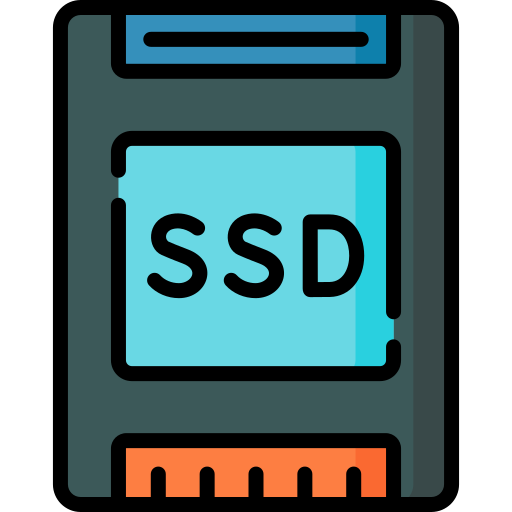
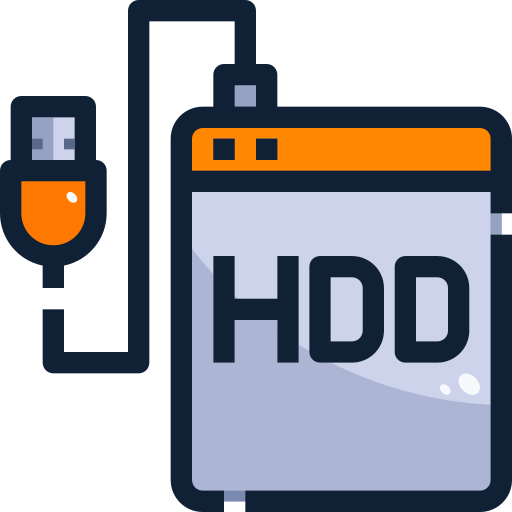
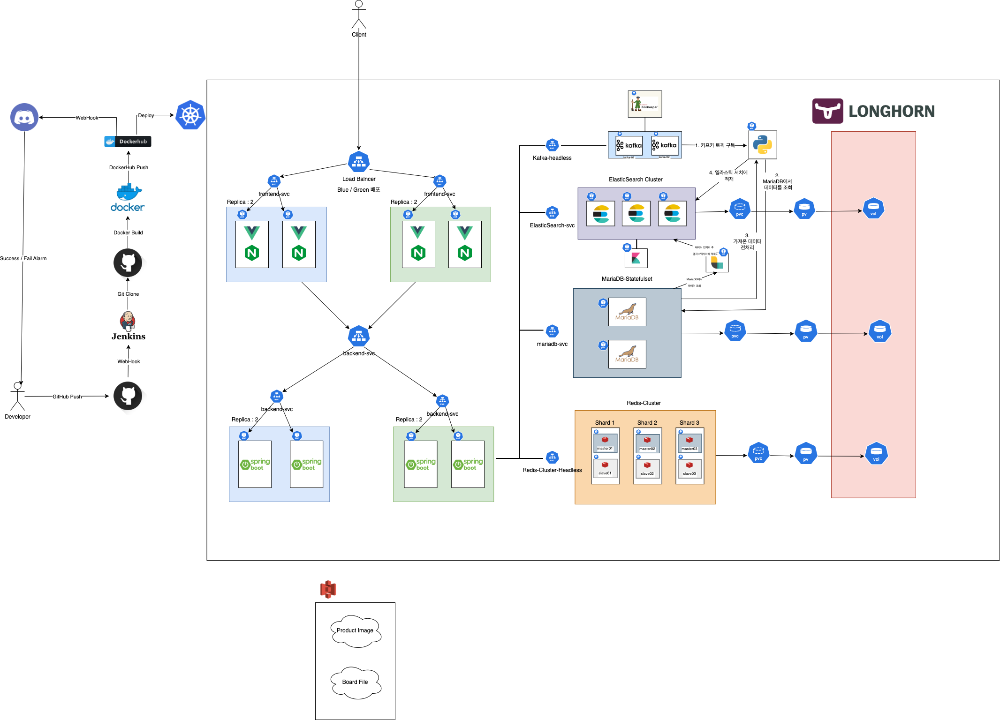
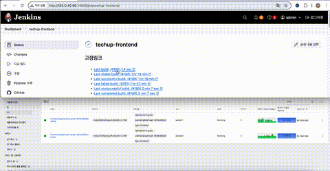
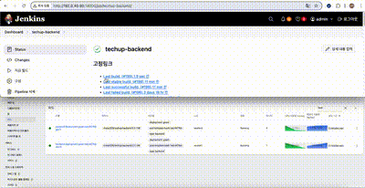

      

## 🎁 팀원 소개

> **[한화시스템 BEYOND SW캠프 12기] Final Project**  
> **404Found팀 Tech-Up 프로젝트**

<table align="center">
 <tr>
    <td align="center"><a href="https://github.com/GoodLeaf"></td>
    <td align="center"><a href="https://github.com/museongkim0"></td>
    <td align="center"><a href="https://github.com/gunha0405"></td>
    <td align="center"><a href="https://github.com/Xen-alpha"></td>
  </tr>
  <tr>
    <td align="center">🐥<a href="https://github.com/GoodLeaf"><b>김정엽</b></td>
    <td align="center">🦊<a href="https://github.com/museongkim0"><b>김무성</b></td>
    <td align="center">😼<a href="https://github.com/gunha0405"><b>오건하</b></td>
    <td align="center">🐰<a href="https://github.com/Xen-alpha"><b>황경윤</b></td>
  </tr>

  </table>
 

### 📑 목차

- [🛠 기술 스택](#-기술-스택)
- [🎨 서비스 소개](#-서비스-소개)
- [🏗️ 시스템 아키텍처](#️-시스템-아키텍처)
- [📚 데브옵스 프로젝트 목표](#-데브옵스-프로젝트-목표)
- [☸️ Kubernetes 선택 이유](#-kubernetes-선택-이유)
- [⚙️ Jenkins 선택 이유](#-jenkins-선택-이유)
- [🚦 Blue/Green 배포 방식 선택 이유](#-bluegreen-배포-방식-선택-이유)
- [🚀 프론트엔드 CI/CD 시나리오](#-프론트엔드-cicd-시나리오)
- [🔧 백엔드 CI/CD 시나리오](#-백엔드-cicd-시나리오)
- [🎬 주요 기능 시연](#-주요-기능-시연)
- [📂 프로젝트 폴더 바로가기](#-프로젝트-폴더-바로가기)

---

## 🛠 기술 스택

#### &nbsp;　[ Frontend ]
&nbsp;&nbsp;&nbsp;&nbsp;

#### &nbsp;　[ Backend ]
&nbsp;&nbsp;&nbsp;&nbsp;

#### &nbsp;　[ DB ]
&nbsp;&nbsp;&nbsp;</a>
 

#### &nbsp;　[ CI/CD ]
&nbsp;&nbsp;&nbsp;&nbsp;

#### &nbsp;　[ Etc ]
&nbsp;&nbsp;&nbsp;&nbsp;

#### &nbsp;　[ Communication ]
&nbsp;&nbsp;&nbsp;&nbsp;

   

## 🎨 서비스 소개

### 📌 프로젝트 배경

기존의 전통적인 배포 파이프라인은 코드 커밋 → 코드 통합 → 빌드 → 배포 준비 → 수동 배포 → 모니터링 순으로 이루어졌으며,  
많은 수작업과 복잡한 통합 과정으로 인해 개발자 실수와 오류 발생 가능성이 컸습니다.

현대적인 CI/CD 파이프라인은 이러한 문제를 보완하고, 반복적인 작업을 자동화하여  
보다 빠르고 안정적인 소프트웨어 배포를 가능하게 합니다.

이번 프로젝트에서는 Jenkins와 Kubernetes 기반의 무중단 배포 시스템을 구축하고,  
개발자의 실수를 줄이면서 서비스 안정성을 확보하는 데 집중했습니다.

---

## 🏗️ 시스템 아키텍처

      

---

## 📚 데브옵스 프로젝트 목표

- `무중단 배포 환경 구축` : Blue/Green 전략과 Jenkins를 활용해 서비스 중단 없이 안정적인 배포 구현
- `CI/CD 자동화` : 코드 변경 → 테스트 → 빌드 → 배포까지의 전 과정을 자동화하여 생산성 향상
- `운영 안정성 및 확장성 확보` : Kubernetes 클러스터 기반의 유연한 확장성과 장애 대응 구조 마련
- `DevOps 전 과정 직접 구현` : 트래픽 전환, 헬스 체크, 롤백 등 운영을 고려한 실전형 배포 환경 구성

---

## ☸️ Kubernetes 선택 이유

이번 프로젝트는 백엔드·프론트엔드의 레플리카 구성, Redis Cluster, Kafka, ELK, Python 추천 서비스, DB(StatefulSet) 등  
여러 구성 요소가 동시에 배포되고 연동되는 구조였습니다.

이처럼 서비스 수가 많고 상태 유지와 확장성이 중요한 구조에서는 단일 서버나 단순 Docker Compose 환경으로는 운영에 한계가 있었습니다.

이에 따라 Kubernetes를 도입하여 다음과 같은 장점을 확보했습니다:

- 서비스별 독립 배포 및 수평 확장 지원
- StatefulSet, Headless Service를 통한 상태 유지형 서비스 운영
- Helm 기반 반복 배포 자동화
- Pod 간 서비스 디스커버리 및 트래픽 흐름 최적화

---

## ⚙️ Jenkins 선택 이유

Jenkins는 직접 구축이 가능하고, 커스터마이징이 자유로운 오픈소스 CI/CD 도구로서  
자체 인프라와 잘 통합되고, 파이프라인 기반의 배포 구성이 용이해 선택하게 되었습니다.

- Kubernetes 기반 인프라에 유연하게 통합 가능
- 스크립트 기반 파이프라인으로 Blue/Green 무중단 배포 구성에 적합
- GitHub 연동 및 빌드 트리거 커스터마이징이 용이

Jenkins는 단순한 자동화 도구를 넘어 CI/CD 흐름 전반을 설계하고 제어할 수 있는 환경을 제공해  
DevOps의 핵심 과정을 실무 수준으로 구현할 수 있게 해주었습니다.

---

## 🚦 Blue/Green 배포 방식 선택 이유

실험적인 기능을 빠르게 추가하는 유형의 프로젝트가 아니기 때문에 무중단 배포와 안정적인 롤백을 목표로, 배포 방식은 Blue/Green 배포 전략을 도입했습니다.  
서비스 중인 버전(Blue)과 신규 배포 버전(Green)을 분리해 운영하고, 문제가 없을 경우 트래픽을 Green으로 전환합니다.

배포 실패 시, 즉시 이전 버전으로 트래픽을 되돌려 서비스 중단 없이 롤백이 가능합니다.  
Jenkins와 Kubernetes를 연동해 배포 → 헬스 체크 → 트래픽 전환 → 모니터링까지의 전 과정을 자동화했습니다.

---

## 🚀 프론트엔드 CI/CD 시나리오

프론트엔드 서비스는 Jenkins와 Kubernetes 기반의 Blue/Green 배포 구조로  
자동화된 CI/CD 파이프라인을 통해 배포됩니다.  
GitHub `main` 브랜치에 푸시되면 다음 절차가 진행됩니다:

### 🔁 전체 배포 흐름

1. **Git Clone** – 저장소에서 소스를 클론
2. **Build & Configuration** – `npm install` → `npm run build`, Nginx 설정값 치환
3. **Docker 이미지 빌드 및 푸시** – `2.0.{빌드번호}` 및 `latest` 태그로 Docker Hub에 업로드
4. **배포 색상 결정** – 현재 상태를 기준으로 Blue 또는 Green 선택
5. **Kubernetes 배포 및 헬스 체크** – YAML 반영, Pod 상태 확인
6. **트래픽 전환 및 이전 버전 종료** – selector 전환 후 기존 버전 스케일 다운
7. **문제 발생 시 자동 롤백** – 이전 배포로 복구 및 트래픽 재전환
8. **Discord Webhook 알림** – 각 단계별 성공/실패 실시간 알림

---

## 🔧 백엔드 CI/CD 시나리오

백엔드 서비스 역시 Jenkins 기반 파이프라인과 Kubernetes 환경에서 Blue/Green 방식으로  
자동화된 CI/CD가 적용됩니다. GitHub `main` 브랜치에 푸시되면 다음 단계가 실행됩니다:

### 🔁 전체 배포 흐름

1. **Git Clone** – 저장소에서 최신 소스 클론
2. **Gradle Build** – `./gradlew bootJar`로 `.jar` 파일 생성
3. **Docker 이미지 빌드 및 푸시** – Docker Hub에 태그별 업로드
4. **배포 색상 결정** – 현재 배포 상태 기반으로 Blue/Green 결정
5. **Kubernetes 배포 적용** – ConfigMap, Service, Deployment 반영 및 적용
6. **안정화 대기 및 상태 검증** – Pod 상태 및 `/actuator/health` 확인
7. **트래픽 전환 및 기존 배포 종료** – selector 변경, 이전 배포 스케일 다운
8. **문제 발생 시 자동 롤백** – 실패 시 이전 버전으로 복구
9. **Discord Webhook 알림** – 단계별 상태 실시간 전송

---

## 🎬 주요 기능 시연

**프론트 엔드 CICD**

      

**백엔드 CICD**

      

## 📂 프로젝트 폴더 바로가기

### [📃 Frontend](https://github.com/museongkim0/Techup)  
### [📃 Backend](https://github.com/museongkim0/Techup/tree/main/backend)
